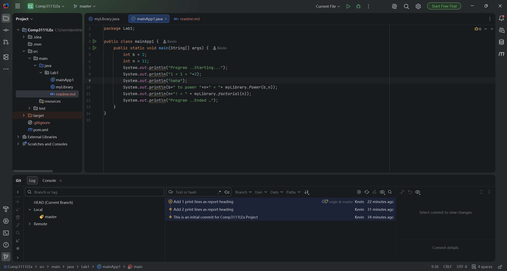

# COMP3111 Lab 1

This is my COMP3111 Lab 1 Maven project.

## Java files

- `myLibrary.java` contains the Power and factorial functions.
- `mainApp1.java` runs the program and displays the results.

## IntelliJ Screenshot

The screenshot below shows the project tree, Java source code, and Git commit log.

